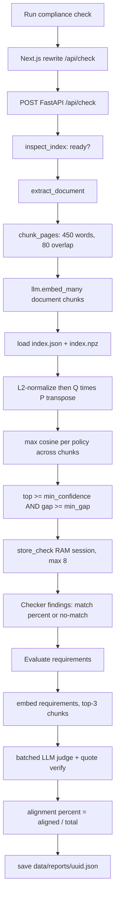
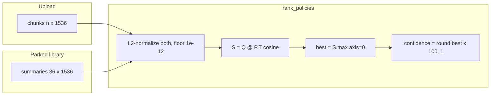
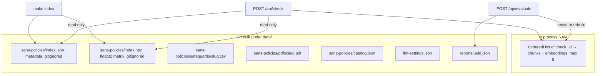

# How it works

A flow map of the Stanford Document Compliance Checker: what happens after
**Run compliance check**, how vector embeddings are matched, where the two
percentages come from, and where those embeddings live on disk.

This document is the *what*. [DESIGN.md](DESIGN.md) is the *why* — the
tradeoffs behind each load-bearing choice. The same explainer lives in the app
under **How it works**, with a toggle for stakeholders and engineers.

---

## Two questions, two percentages

The app answers two questions about an uploaded operating procedure. They
produce two different numbers that must not be mixed up.

| Question | Endpoint | Number | Formula | When it appears |
| --- | --- | --- | --- | --- |
| Which security standard does this belong to? | `POST /api/check` | **Match similarity** | `round(cosine × 100, 1)` | Checker Findings, only if the match gate passes |
| Which requirements of that standard does it satisfy? | `POST /api/evaluate` | **Alignment score** | `round(100 × aligned / total, 1)` | After Evaluate |

Match similarity is *topic closeness* to a policy's Purpose and Scope. Alignment
score is *how many extracted requirements were judged aligned*. A document can
match a policy at 91% and still score 12.5% on requirements.

---

## Offline vs online

Nothing in the request path touches sans.org, parses a policy PDF, or embeds the
standards library. The library is prepared ahead of time.

```mermaid
flowchart TB
  subgraph offline [Offline - make scrape / make index / daily 08:00 PT]
    listing[sans.org listing]
    dateCheck{"published date changed?"}
    pdf[download PDF]
    extractOnce["extract_document once"]
    purpose[Purpose + Scope]
    safeguards[Safeguards section]
    embedPolicy[embed one summary vector]
    llmExtract[gpt-5.6-sol extract requirements]
    indexFiles["index.json + index.npz"]
    csv["safeguards/slug.csv"]
    listing --> dateCheck
    dateCheck -->|no| keep[keep existing PDF]
    dateCheck -->|yes| pdf --> extractOnce
    extractOnce --> purpose --> embedPolicy --> indexFiles
    extractOnce --> safeguards --> llmExtract --> csv
  end

  subgraph online [Online - per upload]
    upload[upload procedure]
    extractDoc[extract + chunk]
    embedDoc[embed document chunks only]
    cosine[cosine vs 36 parked summaries]
    gate[two-part match gate]
    findings[Findings: match percent or no-match]
    evaluate[Evaluate requirements]
    topk[top-3 chunks per requirement]
    judge[batched judge + quote verify]
    report[alignment percent + saved report]
    upload --> extractDoc --> embedDoc --> cosine --> gate --> findings
    findings --> evaluate --> topk --> judge --> report
  end
```



`pdf_sha256` is stamped on both the index row and every CSV row, so the vector
and the requirement list cannot describe different versions of a PDF.

---

## After you click Run compliance check

Frontend: [`compliance-checker.tsx`](frontend/src/components/compliance-checker.tsx)
`runCheck()` → [`checkDocument()`](frontend/src/lib/api.ts) → same-origin
`POST /api/check`. Next.js rewrites that to FastAPI
([`backend/main.py`](backend/main.py) → [`check_upload()`](backend/retrieve/match.py)).



Steps inside `check_upload()`:

1. **Refuse if the library is not parked.** `inspect_index()` returns HTTP 503
   until `make index` has produced a `summary-v1` index whose embedding model
   matches Settings. The request path never silently rebuilds.
2. **Extract text** (`extract_document`) from PDF, DOCX, HTML, Markdown, or text.
3. **Chunk** ([`chunk_pages()`](backend/retrieve/chunk.py)): 450-word windows,
   80-word overlap, ids `{filename-slug}:p{page}:c{index}`.
4. **Embed the upload only.** `llm.embed_many(chunk.texts)` via the provider
   router. The 36 policy vectors are never re-embedded on this path.
5. **Load parked summaries.** Filter `index.json` rows where
   `chunk_kind == "summary"` and take the aligned rows from `index.npz`.
6. **Rank** with cosine similarity (next section).
7. **Gate** with the two-part Settings rule, cache vectors in RAM under a
   `check_id`, return `CheckResponse`.

The Findings well then shows **match similarity only if `matched` is true**. A
no-match lists nearest titles with **no percentages**, so a cosine score cannot
be mistaken for a chosen standard.

---

## How vector matching works

There is no vector database. Ranking is one NumPy matmul in
[`rank_policies()`](backend/retrieve/match.py).

Each policy is represented by **exactly one parked vector**, embedded over
`Title / Category / Purpose / Scope` from
[`build_summary_text()`](backend/retrieve/sections.py) — not overlapping windows
of the PDF body. Shared boilerplate ("Exceptions", "Enforcement") would
otherwise pull every policy toward every document.

The uploaded procedure is split into overlapping chunks and each chunk is
embedded. A long procedure can mention privileged access in one window and
something else in another; the policy that *any single chunk* is closest to
wins that policy's score.



Let `Q` be the document chunk matrix (`n_chunks × 1536`) and `P` the parked
Purpose/Scope matrix (`36 × 1536`). Both are L2-normalized with a 1e-12 floor
so a zero vector cannot produce NaN:

```
query  = Q / ||Q||
parked = P / ||P||
S      = query @ parked.T          # cosine, shape n_chunks × 36
best   = S.max(axis=0)             # best chunk per policy
confidence = round(best * 100, 1)  # the percentage on Findings
```

That percentage is **cosine similarity × 100**. It is not a probability, not a
grade, and not the later alignment score.

Default embedding model is `text-embedding-ada-002` (1536 dimensions), routed
through Stanford Gateway or OpenAI. Anthropic has no embeddings API, so embed
calls fall back automatically.

### Match vs noise

ada-002 compresses scores into a narrow band. An unrelated document can still
sit at ~71% against the nearest policy, which is why an absolute floor is not
enough.

A document matches a standard only if the top policy passes **both** tests,
read from [`data/llm-settings.json`](data/llm-settings.json) and editable under
**Settings → Match rule**:

- Floor: `top >= match_min_confidence` (default **50**). Rejects a uniformly
  weak field.
- Lead: `top − second >= match_min_gap` (default **2.5**). Rejects a field
  where everything scores alike — which is exactly what an unrelated document
  looks like.

With a single candidate there is nothing to be confused with, so the whole
score counts as the lead.

The old rule `MATCH_THRESHOLD = 50.0` sat far below anything ada-002 produces,
so a tree-care calendar scored 71.6% and reported `matched: true`. The lead
test is what makes the no-match branch reachable.

---

## Where embeddings live



### Policy library (durable, gitignored)

Row `i` in the JSON is the vector at row `i` in the NPZ. They are written
together, atomically (`index.json.tmp` / `index.tmp.npz` then `replace`),
under `INDEX_LOCK` in [`backend/retrieve/index.py`](backend/retrieve/index.py).

**[`data/sans-policies/index.json`](data/sans-policies/index.json)**

```json
{
  "format": "summary-v1",
  "embedding_model": "text-embedding-ada-002",
  "dimensions": 1536,
  "built_at": "2026-09-09T22:37:21+00:00",
  "rows": [
    {
      "slug": "privileged-account-management-policy",
      "chunk_id": "privileged-account-management-policy:summary",
      "chunk_kind": "summary",
      "text": "Title: …\nCategory: …\nPurpose: …\nScope: …",
      "pdf_sha256": "…"
    }
  ]
}
```

**[`data/sans-policies/index.npz`](data/sans-policies/index.npz)**

`numpy.savez` archive with a single array key `embeddings`, `float32`, shape
`(n_rows, 1536)`. Built only by `make index` / scrape upsert. `/api/check`
only reads. A model mismatch (`Settings` embedding model ≠ parked model)
makes the index not-ready rather than scoring with the wrong geometry.

### Uploaded document (not on disk)

Document chunk embeddings live in process RAM
([`backend/retrieve/session.py`](backend/retrieve/session.py)): an
`OrderedDict` capped at 8 `check_id`s. They die on reload. `/api/evaluate`
re-runs the check on a miss so the user sees a slower response, never an error.

### Sibling files (not vectors)

| Path | Role |
| --- | --- |
| `data/sans-policies/pdfs/{slug}.pdf` | Downloaded policy PDFs |
| `data/sans-policies/safeguards/{slug}.csv` | Extracted requirements (`slug,title,pdf_sha256,category,definition`) |
| `data/sans-policies/catalog.json` | Listing metadata, published dates |
| `data/sans-policies/schedule.json` | Daily 08:00 PT refresh |
| `data/llm-settings.json` | Provider, models, match floor/lead, output columns |
| `data/reports/{uuid}.json` | Saved evaluation after Evaluate |

---

## What Evaluate does next

Only if `matched` is true. The user picks a ranked policy (default: #1) and
clicks **Evaluate requirements**.

1. Reuse the RAM session (chunks + embeddings) by `check_id`.
2. Load `safeguards/{slug}.csv`.
3. Embed each requirement definition; cosine against the **same document
   vectors**; take top 3 chunks (`TOP_K_CHUNKS = 3`).
4. Judge in batches of 6, 2 concurrent, with `gpt-5.6-sol` at high effort.
5. Treat every row as untrusted:
   [`_normalize_finding()`](backend/retrieve/evaluate.py) downgrades
   `aligned` / `contradicted` to `flagged` if the evidence quote is not
   literally present in a retrieved chunk, or if the cited `chunk_id` was not
   in that requirement's top 3.
6. Alignment score = `100 × aligned / total`. Flagged, contradicted, and
   missing rows do not count as aligned, so the headline understates
   compliance rather than overstating it.
7. Persist to `data/reports/{uuid}.json`.

---

## Worked example

Three committed fixtures in [`tests/documents/`](tests/documents/), all aimed
at Privileged Account Management Policy (16 requirements). Numbers are from
[`test_match_gating.py`](tests/backend/test_match_gating.py) and the verified
browser pass in DESIGN.md.

| Document | Top / runner-up | Lead | Gate | Then |
| --- | --- | --- | --- | --- |
| Privileged-access procedure (compliant) | 91.5 / 85.8 | 5.7 | match | 16/16 aligned → **100%** alignment |
| Same topic, planted violations | 88.1 / 83.0 | 5.1 | match | 2/16 aligned → **12.5%** alignment |
| Tree-care calendar (unrelated) | 71.6 / 70.8 | 0.8 | **no match** | Evaluate stays off; no percentage shown |

71% can still be a miss if two policies are almost tied. A real match stands
clear of the field; noise does not.

The floor-only rule (`top >= 50`) would have called all three a match. The
lead of 2.5 is what separates them. Raising the lead to 6.0 through Settings
also un-matches the compliant procedure (lead 5.7), which is how you know the
knob is live rather than cosmetic.

---

## File map

| Role | Path |
| --- | --- |
| Check + cosine rank | [`backend/retrieve/match.py`](backend/retrieve/match.py) |
| Chunking | [`backend/retrieve/chunk.py`](backend/retrieve/chunk.py) |
| Parked index I/O | [`backend/retrieve/index.py`](backend/retrieve/index.py) |
| Purpose/Scope text | [`backend/retrieve/sections.py`](backend/retrieve/sections.py) |
| RAM session | [`backend/retrieve/session.py`](backend/retrieve/session.py) |
| Evaluate + quote verify | [`backend/retrieve/evaluate.py`](backend/retrieve/evaluate.py) |
| Saved reports | [`backend/retrieve/reports.py`](backend/retrieve/reports.py) |
| Provider router | [`backend/llm/router.py`](backend/llm/router.py) |
| Match knobs | [`backend/llm/store.py`](backend/llm/store.py) |
| Checker UI | [`frontend/src/components/compliance-checker.tsx`](frontend/src/components/compliance-checker.tsx) |
| How it works page | [`frontend/src/app/how-it-works/page.tsx`](frontend/src/app/how-it-works/page.tsx) |
| How it works explainer | [`frontend/src/components/how-it-works.tsx`](frontend/src/components/how-it-works.tsx) |
