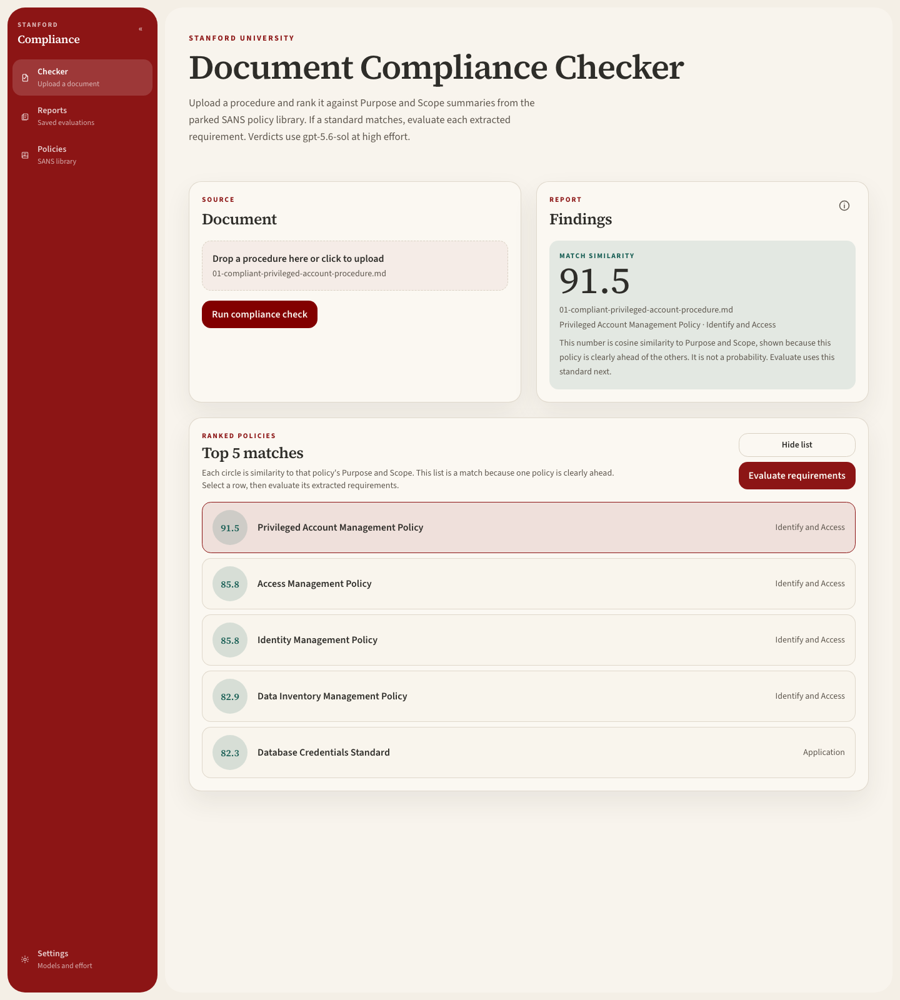
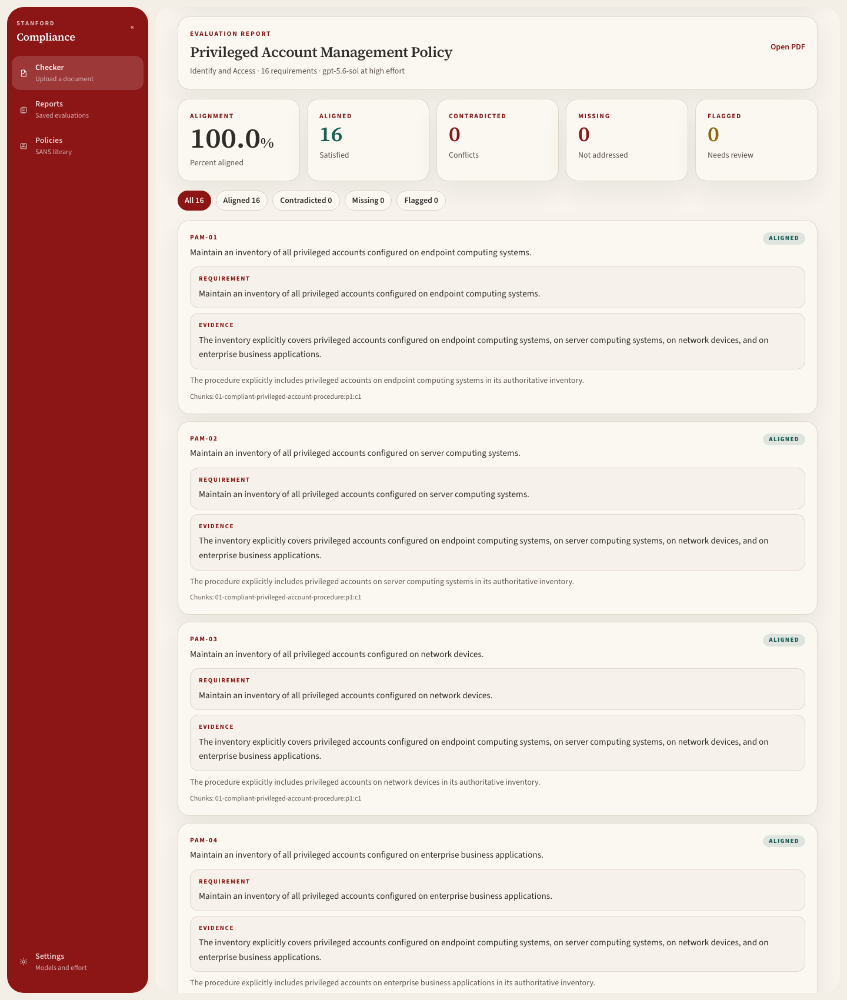
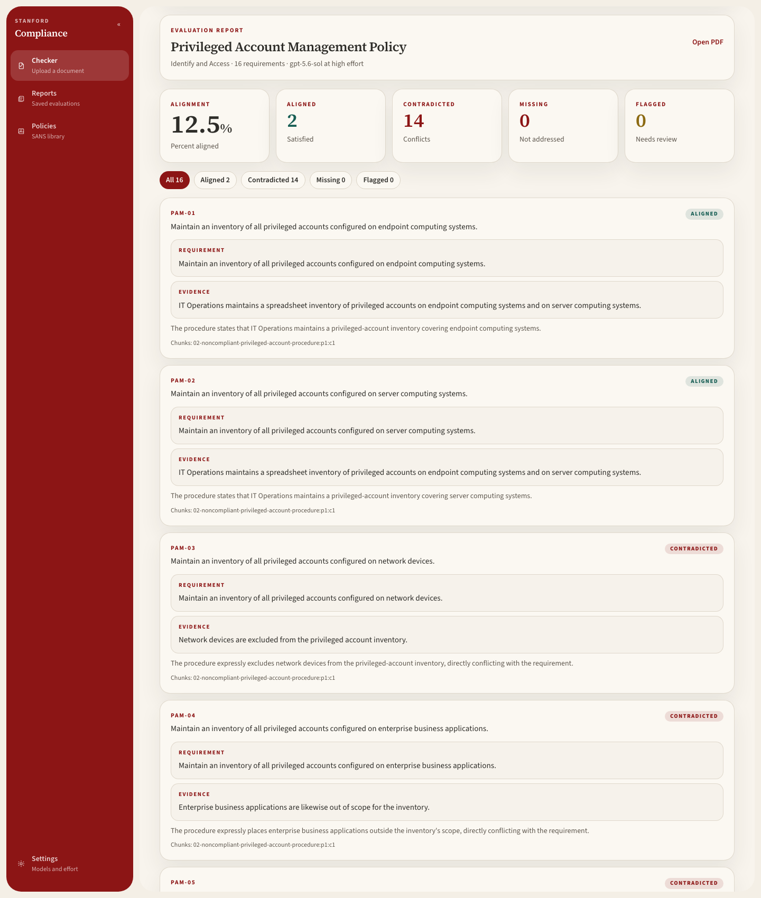
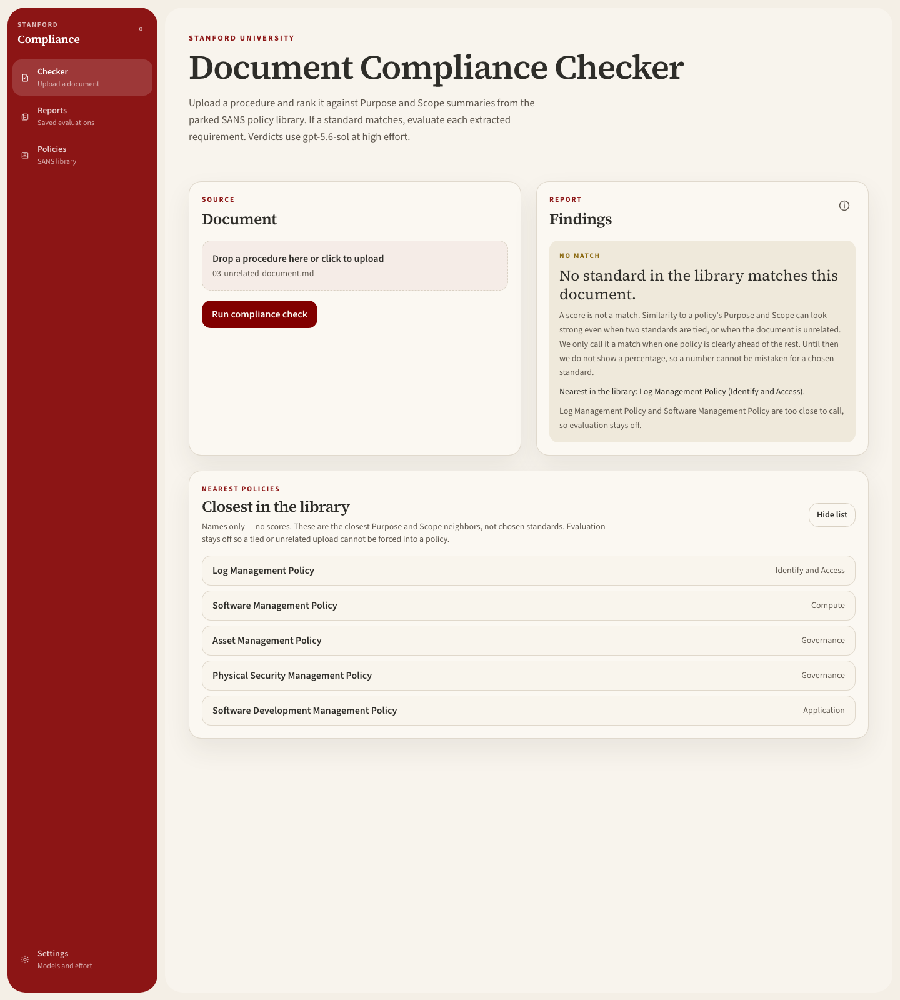

# Stanford Document Compliance Checker

Upload an operating procedure and find out which security standard it belongs to,
then how well it satisfies that standard's requirements.

FastAPI + Next.js. Stage one ranks the document against 36 SANS / CRF security
policy templates using parked embeddings. Stage two judges it requirement by
requirement and returns `aligned` / `contradicted` / `missing` / `flagged` — with
every verdict backed by a quote verified to exist in the uploaded document.

## Quickstart

```bash
make install                              # uv sync + Playwright Chromium + npm install
echo 'AI_GATEWAY_API_KEY=your-key' >> .env.local
make index                                # park the policy embeddings (needs the key)
make start                                # API on :8000, web on :3000
```

Open <http://localhost:3000> and drop in a PDF, DOCX, HTML, Markdown, or text file
(12 MB max).

`make start` creates `.env.local` from `.env.example` if it is missing, then merges
in any new keys without overwriting values you already set. Ctrl+C stops both
servers.

The policy library ships committed — 36 PDFs, `catalog.json`, and the safeguard
CSVs are all in `data/sans-policies/`. So `make index` is the only build step
required before your first upload, and `make scrape` is optional. Skipping
`make index` makes `POST /api/check` return HTTP 503 telling you to run it.

## Prerequisites

- Python 3.11+ and [uv](https://docs.astral.sh/uv/)
- Node.js 20+
- A [Stanford AI API Gateway](https://aiapi-dev.stanford.edu/) key

## Make targets

| Target | What it does |
| --- | --- |
| `make install` | Python deps, Playwright Chromium, and the Next.js app |
| `make start` | Both servers (default target; `make dev` is an alias) |
| `make backend` | FastAPI only, on `127.0.0.1:8000` |
| `make frontend` | Next.js only, on `localhost:3000` |
| `make scrape` | Re-check sans.org and download PDFs whose published date changed. Add `--full` via `uv run python -m backend.scraper --full` to force every PDF |
| `make index` | Embed Purpose/Scope summaries **and** extract safeguards for any policy whose PDF bytes or embedding model changed |

While the API is running, a daily job re-checks the library at **08:00 Pacific**.
Change that time, or trigger a check immediately, from **Policies** in the sidebar.

## Stack

- **Backend:** FastAPI, pypdf, python-docx, NumPy cosine search, Playwright, APScheduler, uv
- **Frontend:** Next.js 16 (App Router), React 19, Tailwind CSS 4
- **LLM:** routed through a provider switchboard — Stanford Gateway (default), OpenAI, or Anthropic, selectable at **Settings** without a restart. Embeddings default to `text-embedding-ada-002`; since Anthropic has no embeddings API, embedding calls automatically fall back to Stanford Gateway or OpenAI.
- **Standards library:** official [SANS / CRF security policy templates](https://www.sans.org/information-security-policy)

## API

Live OpenAPI docs at <http://127.0.0.1:8000/docs> once the backend is running.

| Method | Path | Description |
| --- | --- | --- |
| `GET` | `/api/health` | Service health (`ai_gateway` is `configured` or `missing`) |
| `POST` | `/api/check` | Multipart upload; rank against parked SANS embeddings, return a `check_id` |
| `POST` | `/api/evaluate` | Judge the document against one policy's requirements |
| `GET` | `/api/policies` | Scraped SANS policy catalog |
| `GET` / `PUT` | `/api/policies/schedule` | Daily refresh time (Pacific), last and next run |
| `POST` | `/api/policies/scrape` | Run a date check now; download only what changed |
| `GET` | `/api/policies/{slug}/safeguards` | Extracted requirements (category + definition) |
| `GET` | `/api/policies/{slug}/pdf` | The downloaded policy PDF |
| `GET` / `PUT` | `/api/llm/settings` | Provider, chat model, embedding model, effort, output columns |
| `GET` | `/api/llm/output-schema` | The exact system prompt and JSON schema every verdict call uses |
| `GET` | `/api/llm/models` | Live model list from the current provider |
| `POST` | `/api/llm/chat` | Chat test through the router |
| `POST` | `/api/llm/embeddings` | Embedding test through the router |

```bash
curl -s -X POST http://127.0.0.1:8000/api/check -F "file=@procedure.pdf"
```

## Test documents

Hand-authored fixtures in [`tests/documents/`](tests/documents/) cover the three
outcomes the checker has to get right. Drop them on <http://localhost:3000>.

| File | Purpose |
| --- | --- |
| [`01-compliant-privileged-account-procedure.md`](tests/documents/01-compliant-privileged-account-procedure.md) | A procedure written to the Privileged Account Management Policy |
| [`02-noncompliant-privileged-account-procedure.md`](tests/documents/02-noncompliant-privileged-account-procedure.md) | The same subject with ten planted violations |
| [`02-noncompliant-ANSWER-KEY.md`](tests/documents/02-noncompliant-ANSWER-KEY.md) | Each planted quote and the verdict it should get |
| [`03-unrelated-document.md`](tests/documents/03-unrelated-document.md) | A campus tree-care calendar — no security content, so no match |

### 1. A procedure that complies

Routes to **Privileged Account Management Policy** at 91.5, clearly ahead of the
runner-up. Evaluation: **100.0%** aligned (16 of 16).





### 2. Deliberate violations

Ten planted conflicts, listed in the [answer key](tests/documents/02-noncompliant-ANSWER-KEY.md).
Evaluation: **12.5%** aligned — PAM-01 and PAM-02 only — and 14 contradicted. The
PAM-03 evidence quote is the planted sentence *Network devices are excluded from
the privileged account inventory.*



### 3. Unrelated document

No match. Neighbors are named only — no scores, Evaluate stays off — because Log
Management Policy and Software Management Policy are too close to call.



```bash
curl -s -X POST http://127.0.0.1:8000/api/evaluate \
  -F "file=@tests/documents/02-noncompliant-privileged-account-procedure.md" \
  -F "slug=privileged-account-management-policy"
```

Expected routing, scores, and the match-gap rule that keeps fixture 03 unmatched
are in [tests/documents/README.md](tests/documents/README.md).

## Design

The load-bearing choices: the standards library is refreshed only when a policy's
published date changes, one extraction pass per PDF produces both the embedding and
the requirements CSV, the request path never embeds the library, and every verdict
quote is verified against its source chunk before it is returned.

See **[DESIGN.md](DESIGN.md)** for the reasoning behind each of those, the
tradeoffs accepted, known gaps, and what I would build next.
